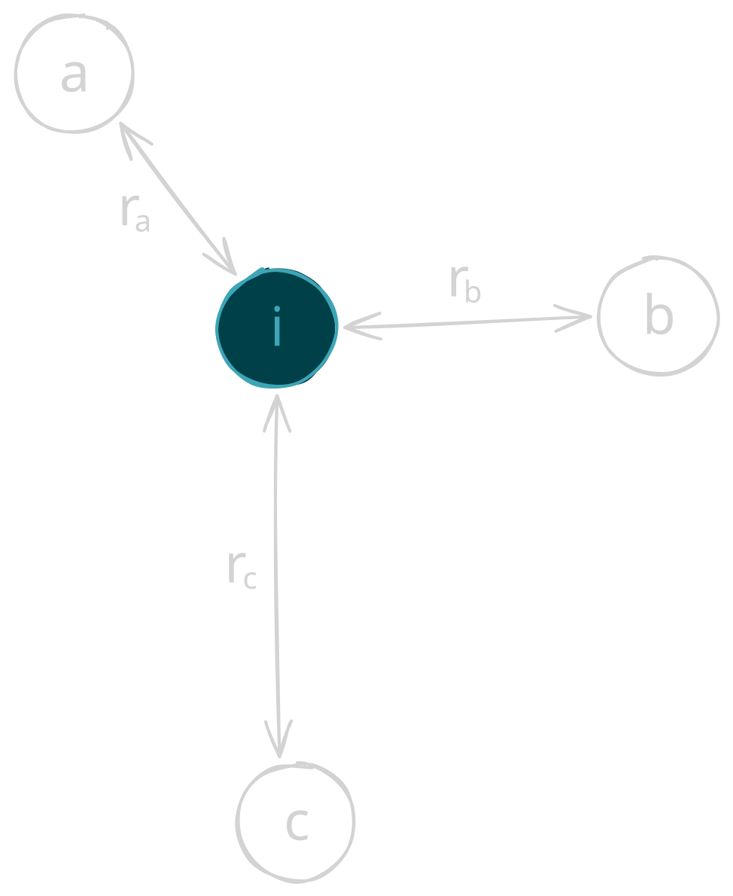

# Smoothed Particle Hydrodynamics (SPH) fluid simulation

This project explores GPU programming and parallel computing through the implementation of a real-time two-dimensional Smoothed Particle Hydrodynamics (SPH) fluid simulation. Rather than relying on an existing physics or simulation framework, the goal is to understand how a particle-based simulation can be designed and executed on the GPU using C++ and Apple's Metal API.

### Why Metal? 

Answer is short. Because I have a Macbook haha. Initially I wanted to explore OpenGL, but since Apple only supports OpenGL 4.1, it was not the best option. Apple's Metal however provides the perfect API for GPU while working under MacOS.

## What is a SPH?

Add Later...

## Particle Physics 

Before implementing SPH, I built the particle simulation incrementally to understand the physics and how it maps onto GPU computation. We start with basic **Kinematics**, which includes velocity, change in time and gravity. 

### Constant Velocity

I started with the simplest physical behavior - a particle moving at a constant velocity. Velocity has both speed and magnitude, and the position ($\mathbf{x}$) is updated as per the formula below:

$$\mathbf{x}_{new} = \mathbf{x}_{old} + \mathbf{v}t$$

Letting $t = 1$, our compute kernel was simply the following:

```Objective-C++
kernel void updateParticlePosition(
            device Particle *particles [[buffer(0)]],
            uint id [[thread_position_in_grid]]) {
    Particle p = particles[id];
    p.position += p.velocity;
}
```

### Time Steps

Time steps, or $\Delta t$ is the mount of simulated time advanced during each simulation update. In other words, what amount of time passes from each update in our simulation.

```C++
static const float kFixedTimestep = 0.016f;
``` 
For now this value remains hardcoded. 

### Gravity 

Gravity is essentially the acceleration experienced by an object due to the gravitational force acting on it. The value is approximately $-9.81 m/s^2$, which we denote as $g$. 

Now when we factor in acceleration, we are no longer dealing with constant velocity. Thus our equation becomes the following

$$\mathbf{v}_{new} = \mathbf{v}_{old} + \mathbf{a}\Delta t$$
    
$$\mathbf{x}_{new} = \mathbf{x}_{old} + \mathbf{v_new} \Delta t$$

In code:

```C++
p.velocity.y += params.gravity * params.dt;
p.position += p.velocity * params.dt;
```

Now we move on to fluid dynamics, which include both Density and Pressure. 

### Density 

In an SPH, density is a measure of how much particle mass is packed around a particle. The equation is the following:

$$p_i = \sum_j m_j W(|x_i - x_j|, h)$$

*   $p_i$ is the density of particle $i$
*   $m_j$ is the mass of particle $i$
*   $W$ is the SPH kernel function (different kernel to a GPU kernel)
*   $h$ is the smoothing radius


**$W(r, h)$ kernal function:**

This function is a weighting function responsible for calculating the level of influence nearby particles have on particle $i$. Take this diagram for example,

<p align="center">
  
</p>

Visually, we see that $r_a < r_b < r_c$ and since particle $a$ is closest to $i$, it will have more influence, thus $W_a > W_b > W_c$.

For the initial simulation, I chose the poly6 kernel function which is the following:

$$W_{\text{poly6}}(r, h) = \frac{315}{64 \pi h^9}(h^2 - r^2)^3$$
 
The naive brute force I did was check all $n$ particles for each particle and add the density if $r < h$. This makes each operation per thread $O(n)$, so despite a $O(n^2)$ algorithm, we have an $O(n)$ due to GPU parallelization. However, we will optimize this algorithm later using a spatial hash grid. 

### Pressure 


