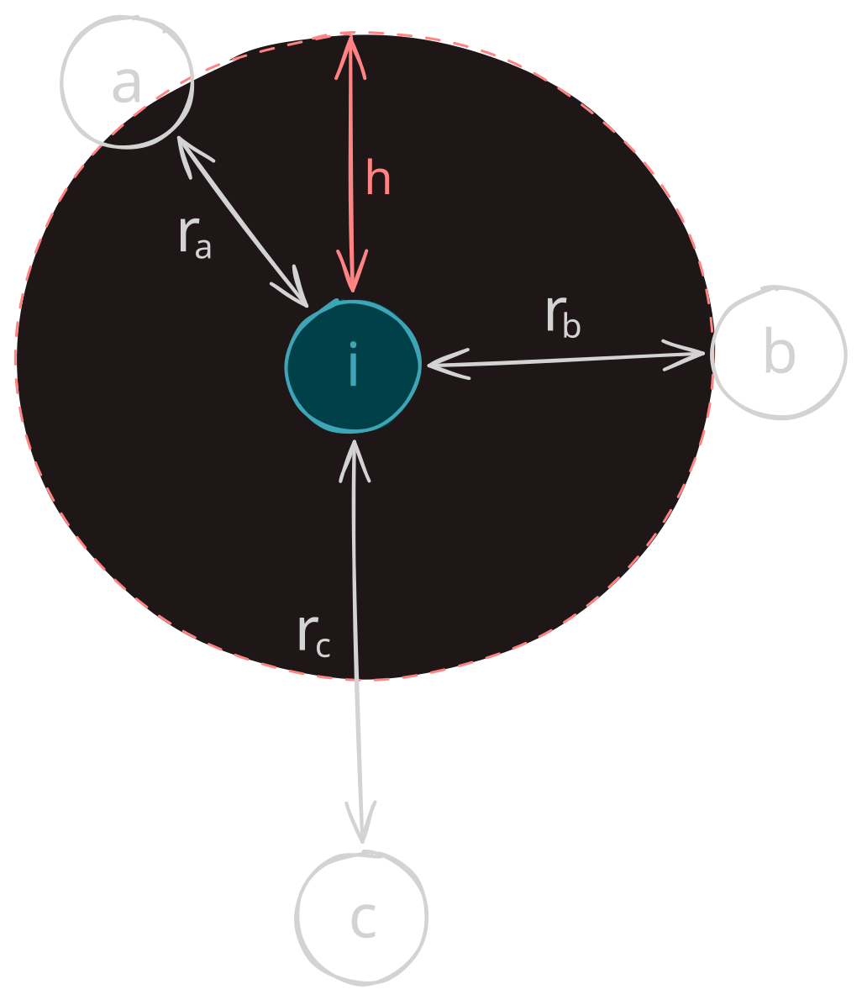
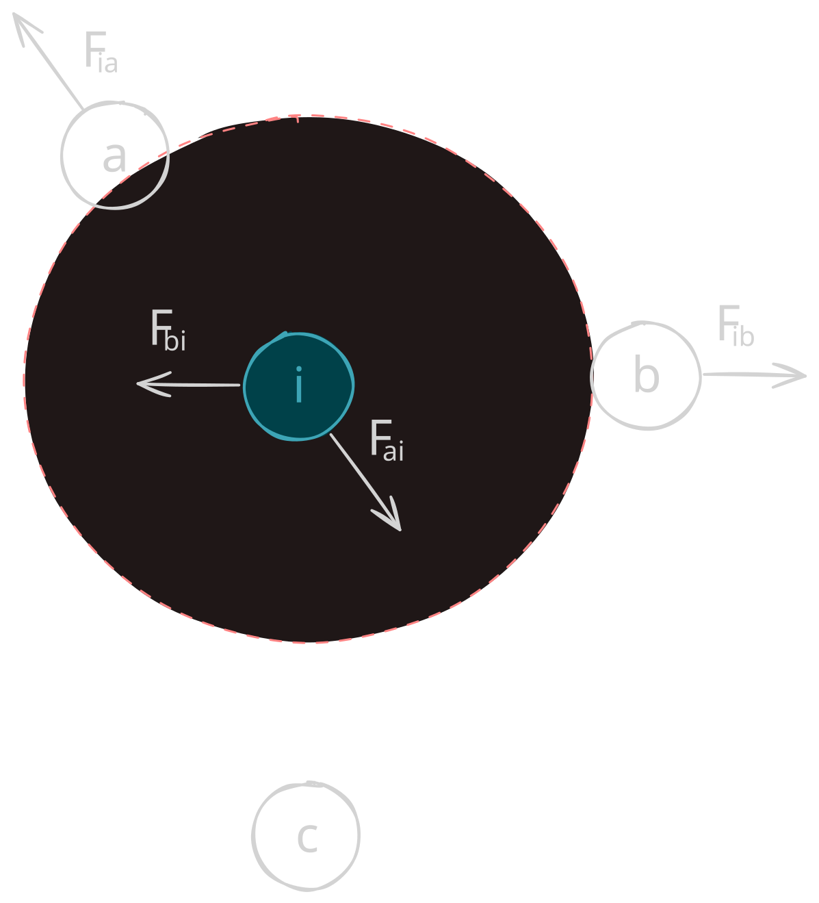
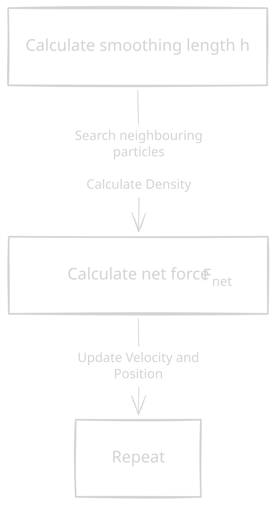
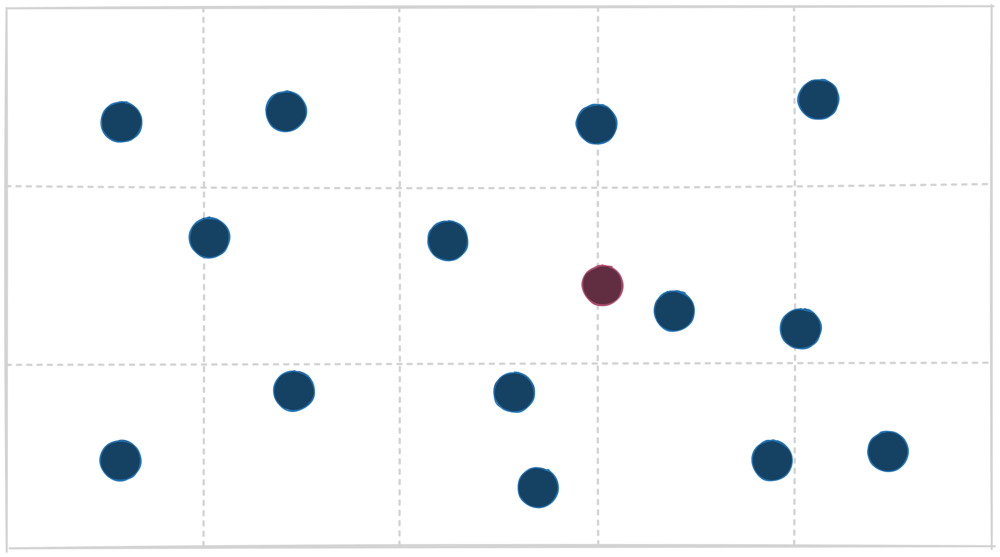
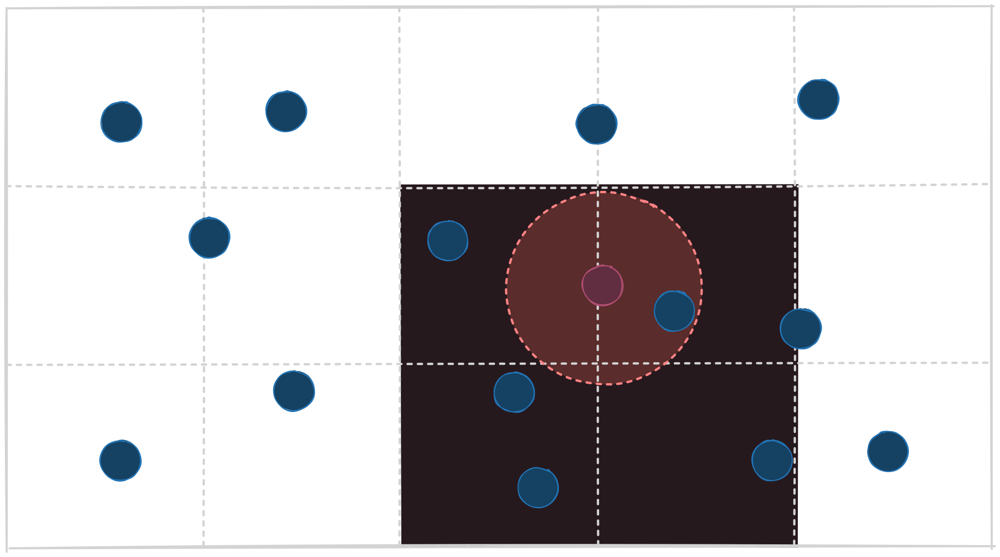
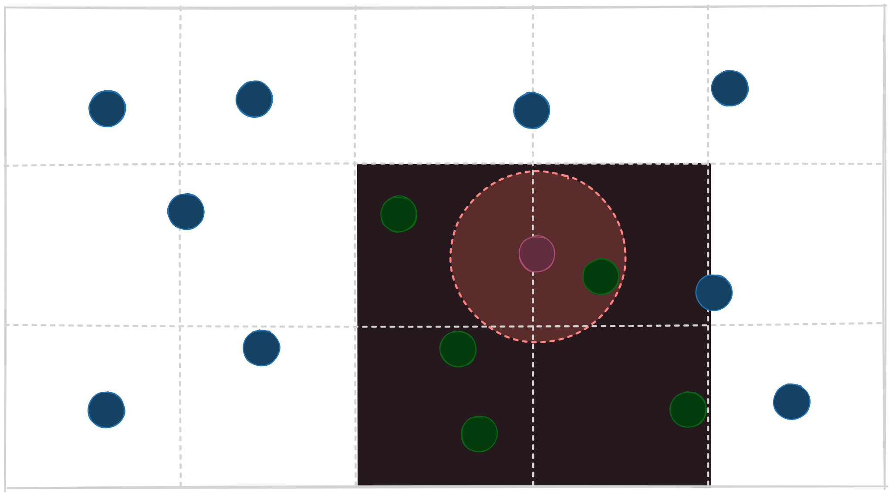
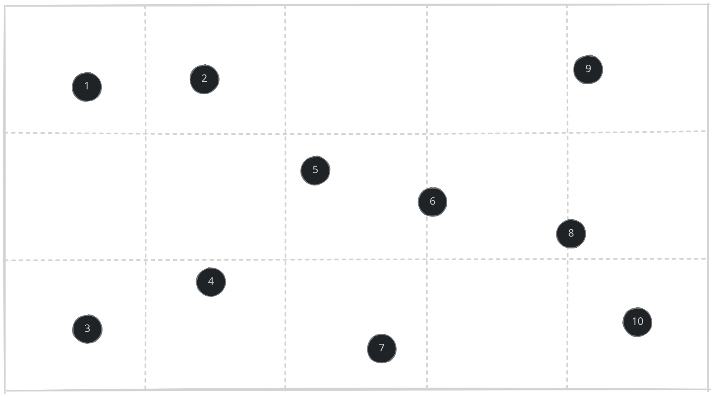
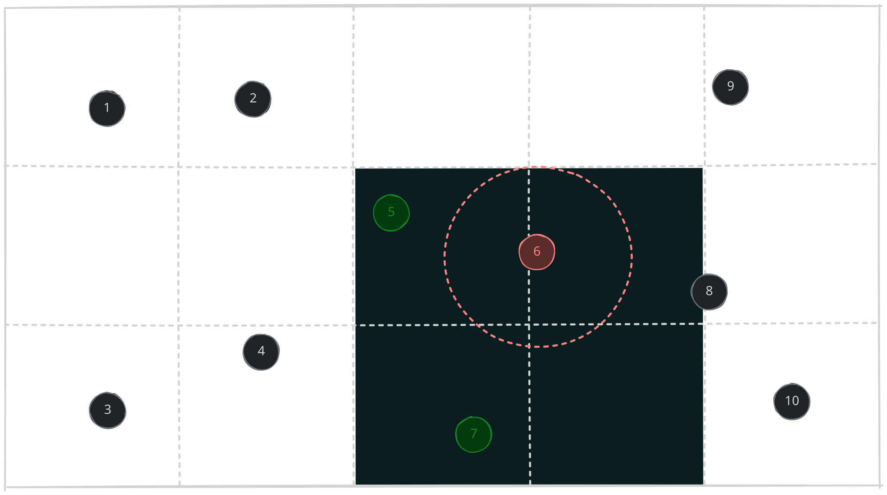

# Smoothed Particle Hydrodynamics (SPH) fluid simulation

## Table of Contents

- [Overview](#overview)
- [What is SPH?](#what-is-sph)
- [Particle Physics](#particle-physics)
  - [Constant Velocity](#constant-velocity)
  - [Time Steps](#time-steps)
  - [Gravity](#gravity)
  - [Density](#density)
  - [Pressure](#pressure)
  - [Viscosity](#viscosity)
  - [Symmetrical Forces](#symmetrical-forces)
- [Implementation Details](#implementation-details)
  - [Simulation Algorithm](#simulation-algorithm)
  - [Substeps](#substeps)
  - [Spatial Hash Grid](#spatial-hash-grid)
  - [Implementation of a Hash Grid](#implementation-of-a-hash-grid)
- [Benchmarking](#benchmarking)
- [References](#references)

## Overview 
This project explores GPU programming and parallel computing through the implementation of a real-time two-dimensional Smoothed Particle Hydrodynamics (SPH) fluid simulation. Rather than relying on an existing physics or simulation framework, the goal is to understand how a particle-based simulation can be designed and executed on the GPU using C++ and Apple's Metal API.

### Why Metal? 

Answer is short. Because I have a Macbook haha. Initially I wanted to explore OpenGL, but since Apple only supports OpenGL 4.1, it was not the best option. Apple's Metal however provides the perfect API for GPU while working under MacOS.

## What is a SPH?

Add Later...

## Particle Physics 

Before implementing SPH, I built the particle simulation incrementally to understand the physics and how it maps onto GPU computation. We start with basic **Kinematics**, which includes velocity, change in time and gravity. 

### Constant Velocity

I started with the simplest physical behavior - a particle moving at a constant velocity. Velocity has both speed and magnitude, and the position ($\mathbf{x}$) is updated as per the formula below:

$$\mathbf{x}_{new} = \mathbf{x}_{old} + \mathbf{v}t$$

Letting $t = 1$, our compute kernel was simply the following:

```Objective-C++
kernel void updateParticlePosition(
            device Particle *particles [[buffer(0)]],
            uint id [[thread_position_in_grid]]) {
    Particle p = particles[id];
    p.position += p.velocity;
}
```

### Time Steps

Time steps, or $\Delta t$ is the mount of simulated time advanced during each simulation update. In other words, what amount of time passes from each update in our simulation.

```C++
static const float kFixedTimestep = 0.016f;
``` 
For now this value remains hardcoded. 

### Gravity 

Gravity is essentially the acceleration experienced by an object due to the gravitational force acting on it. The value is approximately $-9.81 m/s^2$, which we denote as $g$. 

Now when we factor in acceleration, we are no longer dealing with constant velocity. Thus our equation becomes the following

$$\mathbf{v}_{new} = \mathbf{v}_{old} + \mathbf{a}\Delta t$$
    
$$\mathbf{x}_{new} = \mathbf{x}_{old} + \mathbf{v_new} \Delta t$$

In code:

```C++
p.velocity.y += params.gravity * params.dt;
p.position += p.velocity * params.dt;
```

Now we move on to fluid dynamics, which include both Density and Pressure. 

### Density 

In an SPH, density is a measure of how much particle mass is packed around a particle. The equation is the following:

$$\rho_i = \sum_j m_j W(|x_i - x_j|, h)$$

*   $\rho_i$ is the density of particle $i$
*   $m_j$ is the mass of particle $i$
*   $W$ is the SPH kernel function (different kernel to a GPU kernel)
*   $h$ is the smoothing radius


**$W(r, h)$ kernal function:**

This function is a weighting function responsible for calculating the level of influence nearby particles have on particle $i$. Take this diagram for example,

<p align="center">
  
</p>

Visually, we see that $r_a < r_b < r_c$ and since particle $a$ is closest to $i$, it will have more influence, thus $W_a > W_b > W_c$.

For the initial simulation, I chose the poly6 2-D normalized kernel function which is the following:

$$W_{\text{poly6}}(r, h) = \frac{4}{\pi h^8}(h^2 - r^2)^3$$
 
The naive brute force I did was check all $n$ particles for each particle and add the density if $r < h$. This makes each operation per thread $O(n)$, so despite a $O(n^2)$ algorithm, we have $O(n)$ due to GPU parallelization. However, we will optimize this algorithm later using a spatial hash grid. 

**Smoothing radius $h$**

The $h$ value in our density equation is our smoothing radius. This determines whether a particle is close enough to another to actually influence their positon. When we calculate the radius of 2 particles, $r = |x_i - x_j|$, we check if $r < h$ and proceed, and if not we don't account for that particle. 


<p align="center">
  
</p>

In the diagram, $r_a, r_b < h$ and $r_c > h$. Thus we only account for particle $a$ and $b$ in our density calculation. 

In our previous density calculation, the value of $h$ was constant, however this isn't adaptive enough. A smoothing radius should be dependent on the number of neighbors.

### Pressure 

Density tells us how compressed the fluid is locally relative to its rest density. But to enact the force caused by that, we need to calculate pressure. 

To do this, we must use an **Equation of State**, to convert our density to pressure. In this SPH, we use the following formula:

$$p_i = \max (0, k(\rho_i - \rho_0))$$

*   $p_i$ is the pressure from particle $i$
*   $\rho_i$ is the current density
*   $\rho_0$ is the desired density

Notice we apply bound $p_i$ by 0. This is because a negative pressure causes attraction, which we dont want. 

Given the pressure, we must calculate the force enacted from that pressure. To ensure that the pressure forces between two particles obey Newton's Third Law, we require $F_{ij} + F_{ji} = 0$. Hence we arrive at a formula of the following:

$$\mathbf{a}_{\text{pressure-induced}} = -\sum_j m_j \Big(\frac{p_i}{\rho_i^2} + \frac{p_j}{\rho_j^2}\Big) \nabla \mathbf{W}$$

And by Newtons Second Law, $\mathbf{F} = m\mathbf{a}$ gives us 

$$\mathbf{F}_{pressure} = m_i \cdot \mathbf{a}_{\text{pressure-induced}}$$

Notice that we are using the gradient of the kernel function. Instead of poly6, we will use the Spikey Kernel.

$$\mathbf{W}_{\text{spiky}}(r, h) = \frac{10}{\pi h^5}(h - r)^3$$

$$\nabla \mathbf{W}(\mathbf{r}, h) = - \frac{30}{\pi h^5}(h - r)^2 \frac{\mathbf{r}}{r}, \quad \mathbf{r} = \frac{|\mathbf{x}_i - \mathbf{x}_j|}{\mathbf{x}_i - \mathbf{x}_j}$$


For our 3 particle diagram from above, the free body demonstrates the force of pressure enacted on the particles. Notice that since particle $c$ is not within the smoothing radius, it will have no influence.

<p align="center">
  
</p>

### Viscosity
 
Add later

### Symmetrical Forces 


## Implementation Details 

### Simulation Algorithm 

Our SPH simulation will follow the following algorithm.

<p align="center">
  
</p>

### Substeps 

Add Later..

### Spatial Hash Grid

This is probably the biggest optimization made in the simulation. When doing our neighbor search to identify particles with influence, we looped through every particle to check that. 

```
for every particle near particle x
    calculate the distance between particle n and particle x
    check if distance < smoothing length
    if so, then update the pressure force accordingly, otherwise repeat
```

A simple naive implementation, but hugely costly. For a singular particle, we have $O(n-1)$ checks, thus making this algorithm $O(n^2)$, or $O(n)$ from the GPU. However a lot of these checks are quite unessecary since we are checking particles very far away from the current. 

The **spatial hash grid** is a solution to mitigate unessecary checks and only checks particles that *could* be within the smoothing length distance. Take not of the following image:


<p align="center">
  
</p>

Basically, we split the window into grids and assign a particle to one grid. For this example, we will choose a domain of $2 \times 2$ grid for a specific particle. 

<p align="center">
  
</p>

Notice that outer circle represents the smoothing radius of our target particle. The particles (determined by their center) tells us which particles to actually check for our neighbor search. 

<p align="center">
  
</p>

Checking all of them, we see only 1 particle is within the smoothing radius. But the main advantage is how much of the search space we eliminated. 

### Implementation of a Hash Grid 

Consider the labelled particles:

<p align="center">
  
</p>

Each particle has a $(x, y)$ coordinate position. To make sure a particle stricly falls in a grid, we floor each part. Thus the cell is simply $(\lfloor x \rfloor, \lfloor y \rfloor)$.

<div align="center">

| Particle | (x, y)       | Cell   |
| -------- | ------------ | ------ |
| 1        | (0.70, 2.45) | (0, 2) |
| 2        | (1.25, 2.50) | (1, 2) |
| 3        | (0.70, 0.45) | (0, 0) |
| 4        | (1.45, 0.85) | (1, 0) |
| 5        | (2.20, 1.85) | (2, 1) |
| 6        | (3.10, 1.50) | (3, 1) |
| 7        | (2.65, 0.35) | (2, 0) |
| 8        | (4.00, 1.15) | (4, 1) |
| 9        | (4.20, 2.55) | (4, 2) |
| 10       | (4.50, 0.55) | (4, 0) |

</div>

*Note: The example has the coordinate system working upwards, so block 1 would be considered bottom left*

Now we linearize this to be a 1D data structure. To do this is quite simple. 

$$\text{cell}' = \text{grid width} \cdot \text{cell y-coordinate} + \text{cell x-coordinate}$$

In our example, the grid width is 5. Applying this formula gets us 

<div align="center">

| Particle | Cell' | 
| -------- | ------
| 1        | 10    | 
| 2        | 11    | 
| 3        | 0     | 
| 4        | 1     | 
| 5        | 7     | 
| 6        | 8     | 
| 7        | 2     |  
| 8        | 9     | 
| 9        | 14    | 
| 10       | 4     | 

</div>

Now for each cell, we count the number of particles in each cell. Using the index to represent the cell ids (index + 1), we get the following array constructed in $O(n)$ time:

```C++
particle_count = [1, 1, 1, 0, 1, 0, 0, 1, 1, 1, 1, 1, 0, 0, 1]
```

Now we want to sort the array in terms of its cell position. For example, if we had particle 1 and 2 at cell 3 and 4 respectively, but particle 3 at cell 0, then the array we want is [3, 1, 2].

For our example, we get the sorted array:

```C++
hash_grid = [3, 4, 7, 10, 5, 6, 8, 1, 2, 9]
```

Notice that each cell's offset is the sum of all the number of particles before it. Thus we construct a prefix sum from ```particle_count```. Specifically, we start with the running total before each sell, starting with 0. 

```C++
offset = [0, 1, 2, 3, 3, 4, 4, 4, 5, 6, 7, 8, 9, 9, 9, 10]
```

We repeat when there are no particles in that cell

Now lets say we wanted to check the neighbors of particle 6, 

<p align="center">
  
</p>

Given that particle 6 is in cell 8, and since we are checking a domain fo $2 \times 2$, we check cell 2, 3, 7, and 8. 

The retrieval step is simple:

```C++
hash_grid[offset[cell]:offset[cell+1]] = particles
```
$$\text{hashgrid[offset[cell]:offset[cell+1]] = list of particles in cell}$$

In our example, we can retrieve the particles we want to search.

<div align="center">

| Cell | offset[c] | offset[c+1] | Slice | Particles |
|------|-----------|-------------|-------|-----------|
| 2    | 2         | 3           | `hash_grid[2:3]` | `[7]` |
| 3    | 3         | 3           | `hash_grid[3:3]` | `[]` |
| 4    | 4         | 5           | `hash_grid[4:5]` | `[5]` |
| 5    | 5         | 6           | `hash_grid[5:6]` | `[6]` |

</div>

Notice we search 7 and 5 (we don't count the particle 6 itself), and successfully eliminate the rest. 

This approach is gives us $O(1)$ access to the list of particles in that specific cell with $O(n)$ space, while reducing the search space significant (2 searches compared to 10 in our example).

## Benchmarking 

In progress...


## References

Majority, if not all, of the physics and optimizations of this SPH simulation was based on this paper.

Li, M., Li, H., Meng, W. et al. An efficient non-iterative smoothed particle hydrodynamics fluid simulation method with variable smoothing length. Vis. Comput. Ind. Biomed. Art 6, 1 (2023). https://doi.org/10.1186/s42492-022-00128-x
